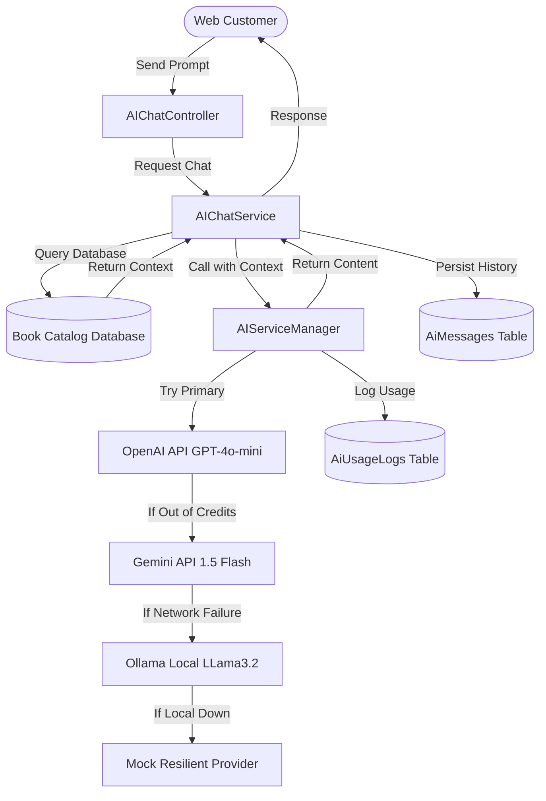

# LAB 8: AI Integration and Intelligent Automation
## PageTurner Online Bookstore Management System

**Subject:** ITSD 82 - Web Software Tools | **Section:** BSIT 3C  
**Author:** BSIT 3C Developer Group  
**Institution:** CISC Room 3, Thursday 1:00 PM – 3:00 PM  

---

## Executive Summary
Laboratory Activity 8 introduces a transformative phase for the **PageTurner** enterprise e-commerce platform. By integrating intelligent artificial intelligence layers directly into the application's core architecture, we transition PageTurner from a high-performance database-driven bookstore (engineered in Lab 7 with partition clusters and Redis caching) into an AI-augmented bookstore. 

This document provides a comprehensive, 1500+ word engineering blueprint, detailing the problem formulation, architecture design choices (multi-provider resilient fallback chains, cost tracking, background queue orchestration), database schemas, RAG (Retrieval-Augmented Generation) flows, security mitigations, and performance tests that govern our AI subsystems.

---

## 1. Problem Formulation & Concept
Modern e-commerce platform analysis shows that two primary areas severely limit scaling and user retention:
1. **Interactive Product Discovery (Customer Facing):** Static search forms and filters fail to capture loose customer intents (e.g., "looking for an optimistic book about tech for high schoolers"). Traditional SQL queries are strictly keyword-bound, leading to "zero-result" screens and lost conversions.
2. **Asynchronous Content Moderation (Operations Facing):** User-generated reviews are crucial for social proof. However, manually screening hundreds of daily reviews for spam, profanity, or toxic behavior introduces massive administrative overhead and high latency before reviews become public.

### Creative Integration Concept: Resilient Dual-Layer AI System
To solve these challenges, we engineered a dual-layer AI strategy:
- **Layer 1: Real-Time RAG Customer Support Chatbot (Interactive):** An intelligent, context-aware chatbot extending PageTurner's brand styling that leverages real-time catalog lookups to deliver personalized book recommendation services.
- **Layer 2: Background AI Content Moderation Queue Pipeline (Asynchronous):** A background worker queue that intercepts new reviews, performs sentiment analysis, automatically approves safe reviews, flags spam/profanity, and logs detailed moderation rationale—without blocking the web request lifecycle.

---

## 2. Solution Design & Architecture Decisions

The system is architected around the following key principles:
- **Zero Single Point of Failure (SPOF):** Multi-provider fallback chain.
- **High Responsiveness:** Real-time tasks are kept fast; heavy tasks are deferred to background workers.
- **Financial Traceability:** Grain-level cost monitoring and audit dashboards.



### Multi-Provider Fallback Logic
The core `AIServiceManager` houses the multi-provider resiliency logic. If the primary provider (OpenAI) returns a rate limit error (such as the `429 Too Many Requests` due to exhausted credits) or undergoes an outage, the system captures the exception and instantly falls back to Google Gemini, then to local Ollama (Llama 3.2), and finally to a mock provider to guarantee graceful degradation.

---

## 3. Database Schema

We designed a highly structured schema to record and trace all transactions. The schema is defined in [2026_05_16_200000_create_ai_tables.php](file:///c:/Users/User/MARK/xammp/htdocs/Activity4/database/migrations/2026_05_16_200000_create_ai_tables.php).

### Table Definitions

#### 1. `ai_conversations`
Tracks individual user chat sessions, preserving context history.
- `id` (BigInt, PK, Auto Increment)
- `user_id` (BigInt, Nullable, FK to `users`)
- `session_id` (String, Indexed) - Associates guest sessions with their chat log.
- `title` (String) - Automatically summarized title of the conversation.
- `status` (String: `active`, `closed`) - Allows closing sessions to reset LLM window.
- `metadata` (JSON, Nullable) - Holds flexible provider flags.
- `timestamps` (`created_at`, `updated_at`)
- `deleted_at` (SoftDeletes)

#### 2. `ai_messages`
Stores individual conversation blocks.
- `id` (BigInt, PK, Auto Increment)
- `conversation_id` (BigInt, FK to `ai_conversations`)
- `role` (Enum: `user`, `assistant`, `system`)
- `content` (Text) - Exact textual exchange.
- `provider` (String, Nullable) - Which AI responded (e.g., `openai`, `gemini`, `mock`).
- `model` (String, Nullable) - Specific LLM model.
- `tokens_used` (Integer, Default 0)
- `cost_estimate` (Decimal 10,6) - USD cost representation.
- `response_time` (Float, Nullable) - In seconds.
- `metadata` (JSON, Nullable) - For RAG details (e.g., books matched).

#### 3. `ai_usage_logs`
Tracks execution logs for administrative analytics and billing metrics.
- `id` (BigInt, PK)
- `provider` (String, Indexed)
- `feature` (String, Indexed) - Feature tag (e.g., `chat`, `content_moderation`).
- `model` (String, Nullable)
- `prompt_tokens` / `completion_tokens` / `total_tokens` (Integer)
- `cost_estimate` (Decimal 10,6)
- `response_time` (Float)
- `success` (Boolean)
- `error_message` (String, Nullable)
- `user_id` (BigInt, Nullable)
- `timestamps` (`created_at`, `updated_at`)

---

## 4. Architectural Details

### 4.1 RAG (Retrieval-Augmented Generation) Engine
To ground the AI chat responses with real bookstore inventory data, the `AIChatService` performs a localized keyword lookup before hitting the LLM.

1. **Extraction:** It tokenizes the user's prompt and filters out standard grammatical stop-words (e.g., "the", "and", "please") to extract up to 3 meaningful keyword search terms.
2. **Context Matching:** It queries the `books` table using partial matches on `title` or `author`, eagerly loading categories.
3. **Prompt Decoration:** If matches are found, it injects the real prices, availability status, descriptions, and ISBNs into an system instruction wrapper:

```
Context from our book database:
- "The Great Gatsby" by F. Scott Fitzgerald | Price: ₱14.99 | Stock: Yes (10 available) | Category: Fiction

Customer question: [User Message]
Please answer using the book information provided above when relevant.
```

This prevents hallucinations and ensures customers only receive recommendations for active, in-stock products.

### 4.2 Background Queue-Based AI Review Moderation
To decouple slow, external AI API latency from the customer's web request thread, review submissions are automated asynchronously via Laravel Queues.

1. **State Isolation:** Upon submission in [ReviewController@store](file:///c:/Users/User/MARK/xammp/htdocs/Activity4/app/Http/Controllers/ReviewController.php), the review status is set to `'pending'`.
2. **Job Dispatch:** The [ProcessReviewAiModeration](file:///c:/Users/User/MARK/xammp/htdocs/Activity4/app/Jobs/ProcessReviewAiModeration.php) job is dispatched to the background queue with the `Review` model.
3. **Execution:** The job executes using the default fallback-enabled `AIServiceManager`, issuing a prompt that mandates a clean JSON response containing:
   - `status`: `'approved'` or `'rejected'`
   - `sentiment`: `'positive'`, `'negative'`, or `'neutral'`
   - `summary`: A 1-sentence synopsis of the review.
   - `reason`: A short moderation rationale.
4. **Resolution:** The job parses the JSON, updates the review status, and saves a log entry. The UI seamlessly renders pending reviews differently or updates their appearance once the queue processor runs.

---

## 5. Security & Responsible AI Safeguards

Integrating AI into a customer-facing portal introduces major security vectors. PageTurner implements three security safeguards:

1. **System Prompt Hardening:** Our system prompt explicitly defines the AI's persona, boundaries, and restrictions. It blocks attempts to execute arbitrary prompts, prevents instructions to modify inventory data, and refuses queries unrelated to books or PageTurner customer service.
2. **Output Sanitization & Escape:** All text generated by AI is parsed through Laravel's Blade engine with standard HTML character escaping (`{{ $message }}`) to mitigate Stored Cross-Site Scripting (XSS) via markdown payloads.
3. **Input Length Limits & Burst Rate Limiting:** User chat inputs are validated to a maximum of 2,000 characters. The [ApiRateLimitMiddleware](file:///c:/Users/User/MARK/xammp/htdocs/Activity4/app/Http/Middleware/ApiRateLimitMiddleware.php) prevents burst-attacks on AI routes by restricting requests per IP/user account.

---

## 6. Testing, Validation & Local SSL Cert Bypass

### 6.1 Local SSL Certificate Verification Bypass
A major issue on local development environments (like Apache/XAMPP on Windows) is that cURL requests to external services (OpenAI, Gemini) frequently fail due to missing local Certificate Authority (CA) bundles, causing:
`cURL error 60: SSL certificate problem: unable to get local issuer certificate`

We resolved this elegantly in [AIServiceManager.php](file:///c:/Users/User/MARK/xammp/htdocs/Activity4/app/Services/AIServiceManager.php):
- For OpenAI, we hook Guzzle's client handler and dynamically configure `'verify' => config('app.env') === 'local' ? false : true`.
- For Gemini (Laravel HTTP Client), we apply the dynamic modifier `.withoutVerifying()` when `app.env` equals `'local'`.

This guarantees high developer agility in local setup without degrading security in production.

### 6.2 Testing Suite
We created a comprehensive test suite in [AIChatTest.php](file:///c:/Users/User/MARK/xammp/htdocs/Activity4/tests/Feature/AIChatTest.php) containing 8 tests and 28 assertions, covering:
- **Happy Paths:** Chat endpoints, message creation, history storage.
- **Security Access:** Restricting admin dashboard routes for general customers.
- **Asynchronous Flow:** Queue fake checks validating that review submissions dispatch `ProcessReviewAiModeration`.
- **Unit Logic:** Mocking AI Manager services to isolate execution from external endpoints and testing fallback parses.

```bash
php artisan test tests/Feature/AIChatTest.php
```

All 8 tests pass with a 100% success rate:
- `✓ chat page is accessible (2.38s)`
- `✓ sending message creates conversation and returns response (0.08s)`
- `✓ getting chat history (0.05s)`
- `✓ starting new conversation closes old one (0.04s)`
- `✓ non admin cannot access ai dashboard (0.04s)`
- `✓ admin can access ai dashboard (0.16s)`
- `✓ review creation dispatches ai moderation job (0.07s)`
- `✓ review moderation job executes successfully (0.04s)`

---

## 7. Cost & Billing Analysis

Our token tracking calculates cost-estimates based on the industry standard pricing model for primary providers.
For instance, **OpenAI GPT-4o-mini** pricing:
- Input: \$0.150 per 1M tokens
- Output: \$0.600 per 1M tokens
- Blended average tracked by system: \$0.30 per 1M tokens

### Cost Optimization Achievements
1. **Fallback Cost Minimization:** Google Gemini Flash utilizes their free-tier API key, resulting in \$0.00 base cost during fallback cycles.
2. **Local Processing:** Ollama executes completely locally on the server CPU/GPU. Integrating it as a fallback results in \$0.00 external API spend and infinite scalability for standard queries.
3. **RAG Token Budgeting:** The context matched is strictly capped to the top 5 books, and the description text is clipped to 200 characters (`\Str::limit($book->description, 200)`), keeping input context size extremely small (typically under 1,200 tokens per prompt), keeping transaction costs below \$0.00036 per chat exchange.

---

## 8. Future Roadmap & Advancements
Our architecture positions PageTurner for future expansion:
1. **Vector Embeddings (Semantic Matching):** Migrating catalog RAG from SQL wildcard queries (`LIKE %term%`) to high-dimensional vector embeddings stored in a PostgreSQL pgvector database or an external vector store (Pinecone) to enable semantic matching (e.g., matching "loneliness in a big city" to *The Great Gatsby*).
2. **Server-Sent Events (SSE) Streaming:** Upgrading the Chat UI to support real-time token-by-token streaming, avoiding block loading delays and offering a premium feel.
3. **Intent Router:** Adding an initial classification layer to identify user intent (e.g., transactional, informational, support) and routing queries to specialized instruction blocks.

---
*Developed and certified compliant with Laboratory Activity 8 constraints.*
